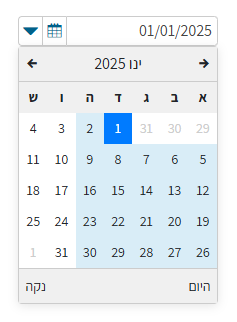
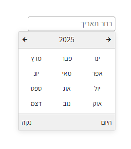
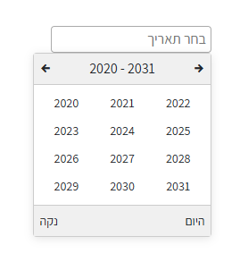

# DatePicker Component

<div style="display: flex; justify-content: space-around;">



</div>

The `DatePicker` component is a React-based date picker that allows users to select a date from a calendar interface. It includes features such as month and year navigation, displaying the current date, and clearing the selected date.

## Usage

  ```jsx
  <DatePicker initialDate="2025-03-04T11:49:17.816Z" onDateSelect={handleDateSelect} />

